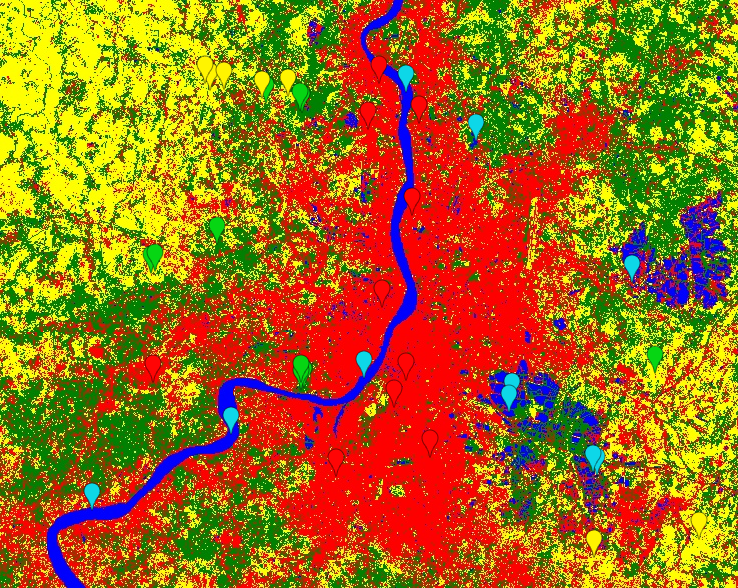

# 🛰️ Land Cover Classification Using Sentinel-2 Imagery (Kolkata 2023)

## 📖 Project Overview
This project focuses on **land cover classification** for **Kolkata (India)** using **Sentinel-2 multispectral satellite imagery** for the year **2023**.  
The goal is to identify and analyze various land cover types — **urban areas, water bodies, forests, and farmland** — using **machine learning and geospatial processing** techniques in **Google Earth Engine (GEE)**.

---

## 🎯 Objective
To build a supervised classification model that accurately categorizes land cover types in the Kolkata region based on spectral signatures and vegetation indices.

---

## ⚙️ Methodology

### 1. **Data Collection**
- Used **Sentinel-2 Level-2A** imagery from **January–December 2023**.  
- Filtered images over the **Kolkata region of interest (ROI)**.  
- Applied a **median composite** to minimize cloud and atmospheric effects.

### 2. **Preprocessing**
- Selected key spectral bands:  
  `B2 (Blue), B3 (Green), B4 (Red), B8 (NIR)`  
- Computed the **Normalized Difference Vegetation Index (NDVI)**:  
  \[
  NDVI = \frac{B8 - B4}{B8 + B4}
  \]
- Created a stacked image with the selected bands + NDVI.

### 3. **Training Data**
- Manually labeled **four land cover classes** using point features:  
  - 🌳 **Forest**  
  - 🏙️ **Urban area**  
  - 💧 **Water body**  
  - 🌾 **Agriculture/Farmland**

### 4. **Model Training**
- Used a **Random Forest classifier** with 100 decision trees (`ee.Classifier.smileRandomForest(100)`).  
- Split data into **80% training** and **20% testing** subsets.  
- Extracted sample pixel values using `.sampleRegions()`.

### 5. **Classification & Visualization**
- Classified the entire image into four land cover categories.  
- Applied a color palette for visual interpretation:
  - **Blue → Water body**  
  - **Red → Urban area**  
  - **Yellow → Farmland**  
  - **Green → Forest**

---

## 🗺️ Classified Land Cover Map

> **Color Legend:**  
> 🟦 Blue → Water body  🟥 Red → Urban  🟨 Yellow → Farmland  🟩 Green → Forest

---

## 📊 Model Performance
| Metric | Accuracy |
|--------|-----------|
| **Training Accuracy** | ~98% |
| **Validation Accuracy** | ~83% |

Confusion matrices for both training and validation datasets were generated to assess model reliability.

---

## 💡 Key Insights
- High vegetation density detected in **Kolkata outskrits** areas.  
- **Urban expansion** clearly visible in central and northern zones.  
- **Water bodies** such as lakes and rivers accurately delineated.  
- Demonstrates the potential of **remote sensing + ML** for environmental monitoring and land use assessment.

---

## 🔗 Google Earth Engine Script
You can access the full interactive code on **Google Earth Engine** here:  
👉 [**View GEE Script**](https://code.earthengine.google.com/?accept_repo=users/ndas49784/sattelite_imgary)  

---

## 🧰 Tools & Technologies
- **Google Earth Engine (JavaScript API)**  
- **Sentinel-2 Level-2A Imagery**  
- **Random Forest Classifier**  
- **NDVI Computation**  
- **Geospatial Data Visualization**

---

---

## 👨‍💻 Author
**Niloy Das**  
📫 *Email:* [ndas49784@gmail.com]  
🔗 *LinkedIn:* [[niloydas34](https://www.linkedin.com/in/niloydas34/)]  

---

⭐ *If you find this project useful, feel free to star the repository!*
